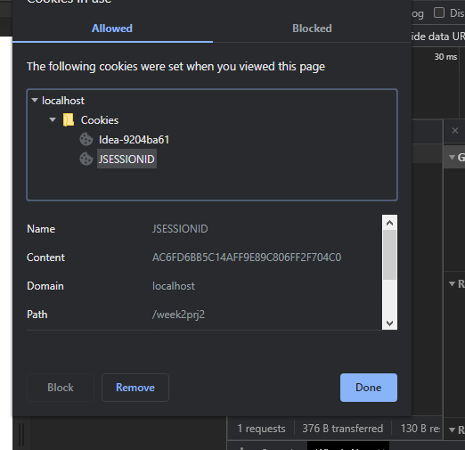

## Monitoring HTTP Headers 1

**1. Observe and explain each of the values monitored (use view source to see the plain messages)**

- Der bliver sendt et GET request med en URL
- vi modtager derefter en statuskode 200, hvilket betyder at alt gik godt.
- Ændre vi dermimod index.html til index1.html får vi en 404 fejl som er en file not found fejl

**2) Monitoring HTTP Headers 2**

- Her gives der en 304 status kode, der indikere at der ikke er blevet lavet nogle ændringer siden sidste request, og derfor bliver requestet ikke transmitteret
- der vises get metoder på css og imaget der er blevet tilføjet
- Connection headeren viser os at den er keep-alive.

**3) Monitoring HTTP Headers 3  (Response-codes 3xx)**

Åbner vi vores side `http://localhost:8080/week36_day2_part1/` kan vi tilgå vores "index" -side.
Skriver vi `http://localhost:8080/week36_day2_part1/redirect` kan vi se to filer i netværksfanen.

- r.htlm er siden vi oprettede - vi kan se i statussen at vi får en 200 - alt okay
- Redirect er vores servlet - vi kan se i statusen at der er tale om en redirect (status 302), vi kan se den henviser til `location: r.html`

**3a) Redirecting to HTTPs instead of HTTP**

Den første responce bliver håndteret medstatus 302 - en re-direct.
I responce header kan vi se https under location.

Den næste request på listen er med status 200 som er https version af siden vi ender på.

**4a. Status Codes (5xx)**

Serveren genererer en 500 fejlkode fordi der dividerers med 0

**4b. Status code (400)**

Serveren genererer en 404 fejlkode med følgende besked
``The origin server did not find a current representation for the target resource or is not willing to disclose that one exists.``

**4c) Status Codes - Ranges**

- 2xx = Success
- 3xx = Redirection
- 4xx = Client errors
- 5xx = Server errors

**5) Get HTTP Request Headers on the Server**

Løst med java som dette.

Her bliver det udskrevet i konsol:
```java
Enumeration<String> headerNames = request.getHeaderNames();
while (headerNames.hasMoreElements()) {
    String headerName = headerNames.nextElement();
    System.out.println("Header Name - " + headerName + ", Value - " + request.getHeader(headerName));
}
```
eller udskrevet i table på siden:
```java
out.println("<table border=\"1\">");
out.println("<tr><th>Header</th><th>Value</th></tr>");
while (headerNames.hasMoreElements()) {
    String headerName = headerNames.nextElement();
    out.println("<tr><td>" + headerName + "</td><td>" + request.getHeader(headerName) + "</td></tr>");
}
out.println("</table>");
```

**6) Get/Post-parameters**

Ved at submitte en form som bruger "GET" kan form parametrene ses i URL. 
``http://localhost:8080/week36_day2_part1/opg6.html?fname=hej+kaj&lname=hej+bøje&hidden=12345678#``

Ændres formens metode til "POST" vil de indtastede data fremgå af "Form Data" som kan ses i "Network" tools.

**7) Sessions (Session Cookies)**

- A
  Giver os mulighed for at indsætte request parametre.

- B
 Jeg skriver ``/SessionDemo?=name=Morten`` når jeg køre filen.
 Dette giver muligheden for at indtaste mit navn og giver efterfølgende en welcome Morten side.

- E
  Det nuværende state opretholdes via en session cookie
  Slettes denne session-cookie vil formularen dukke op igen og der skal dermed tastes navn på ny.

**8) Persistent Cookies**
For en persistent cookie bestemmer serveren (rettere programmet på serveren) en cookies udløbstid -
I nedenstående billede kan vi se cookie oplysningerne


